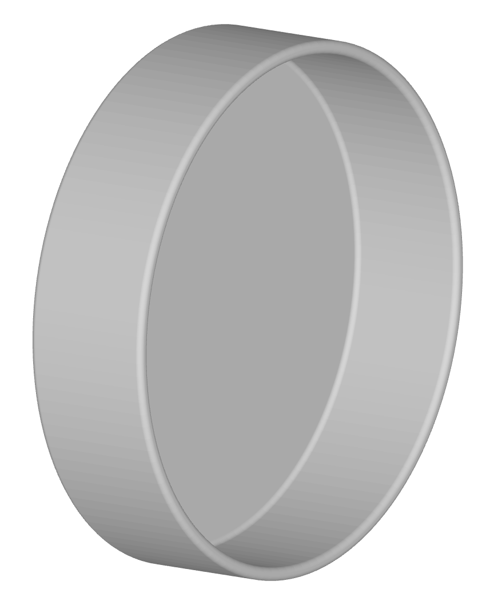

# lens-cap-design

## Description

A tool to build CAD models for slip over camera lens caps.



## Prerequisites
Make sure you have `pip` and `python3` installed on your system. You can check by running on the command line:

```
python3 --version
pip --version
```

## Installation

Clone the repository and install the package using pip:

```
git clone https://github.com/acc-aqt/lens-cap-design
cd lens-cap-design
pip install .
```

## Execution

Call `build-lens-cap -h` to see available arguments.

## Development Setup (if needed)

If you are developing or testing and need to use the source code directly:

- Run `make setup-venv` to create and activate a virtual environment. The python interpreter is located in `.venv/bin/python3`.

- Run `make install` to install the project in develop mode.

- Run `make test` to run the tests.